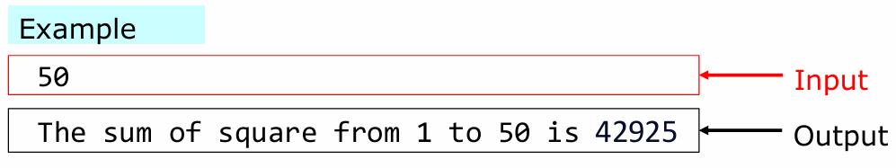
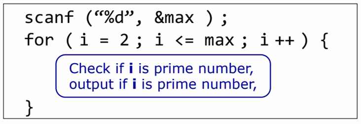
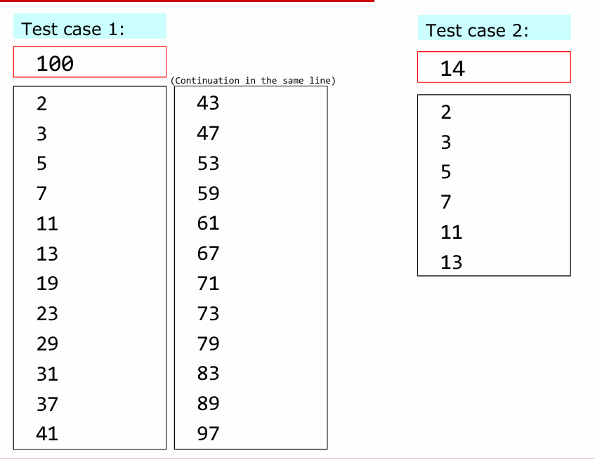
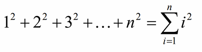
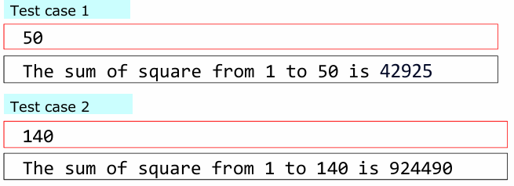
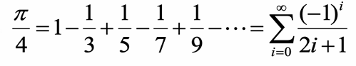
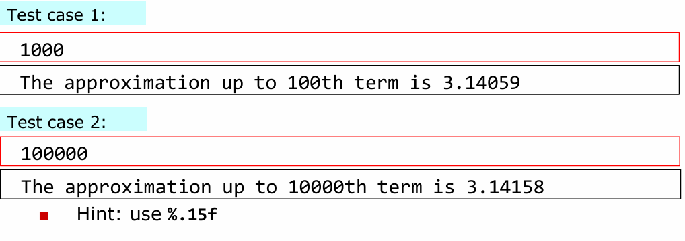
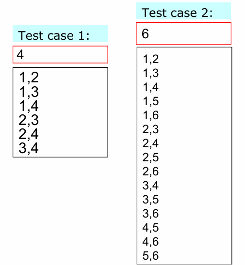

# Week6 
Control Flow III
## Note:
Please note that it is very important for your program to have the same input and output as shown in the test cases. Please keep in mind things such as spacing, capitalization, line breaks (\n), etc. The test cases provided for the exercises will consist of the input (red box) and the output (black box). All the information in the boxes are assumed to consist of no extra spaces (before and after the information).

For example:

## Basic Homework I
* Write a program that takes the integer max and outputs all teh prime numbers less than max.
* The output shoudl be lined up horizontally in one line with a space between numbers with a new line at the end.

### Hint: The organization of the program

**Please use the following test cases with the homework:**
___

## Basic Homework 2 
*  For an input integer n, the sum of integer from 1 to n is as:

*  Using a for loop, write a program that takes the value n and calculate and output sum of square from 1 to n
*  Hint: add the variable sum to the square of i (represented as i*i)

**Please use the following test cases with the homework:**

___

## Basic Homework 3 
*  Use Leibniz formula for Pi (π) to calculate Pi. When input integer n it sums  up  to  the  nth  term  of this following series and multiply by 4 to output an approximation of Pi.

 ### Hint:
 *  Be careful not to do the operation by integer. For example, if i is int type 1/(2*i+1) will result in 0. In this case, you must change to 1.0/(2*i+1)
 *  This infinite series is an alternating of positive and negative value for each term. One possible method to  implement  the  program  is  to  multiply  the expression summation in the previous page by a power of -1, using pow function like before
 *  Alternative  method  1)  prepare  a  variable  to  hold positive and negative value and invert it after each iteration
 *  Alternative  method  2)  Depending  on  whether  the variable i is even or odd number, we can decide whether to add or to subtract it
 *  As n is getting larger, the closer the calculated value to the true value of Pi. It is interesting to consider the relationship between n and error of Pi.
 *   %f  outputs double up to 6 decimal places by default, but you can set it to as many as 15 decimal places using %.15f
 *  Decimal places: number of significant digits
 *  Let’s find out the true value of Pi and compare it with your calculation results.

**Please use the following test cases with the homework:**

## Advanced Homework I
*  Create a porgram that takes the value **n** and outputs two different number pair from 1 to an input n
*  **Hint**: Use Nested Loop
*  **Note**: By having the same number (1,1) or different order number pair (1,3) (3,1) will appear. So, be careful with the variable range in the loop.

**Please use the following test cases with the homework:**

  

